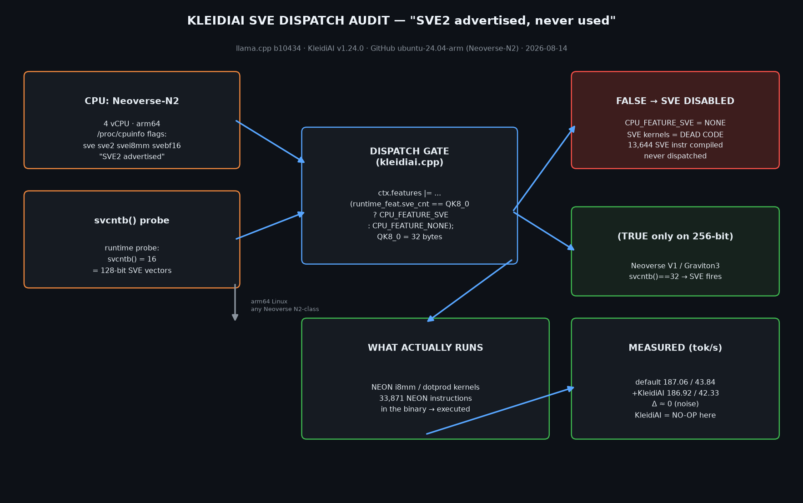
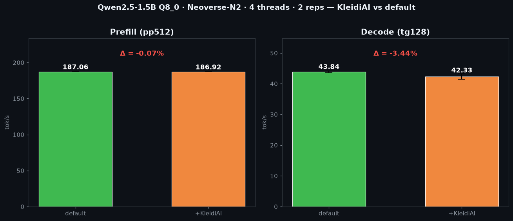

# Neoverse SVE Dispatch Audit — "SVE2 advertised, never used"


**Measured on GitHub-hosted `ubuntu-24.04-arm` (Neoverse-N2, 4 vCPU) with llama.cpp `b10434` + KleidiAI v1.24.0.**

> **The finding:** On 128-bit-SVE Neoverse cores (N2, Graviton4, Azure Cobalt 100 — every free Arm CI runner),
> KleidiAI's SVE matmul kernels are **dead code**. The dispatch gate is `runtime_feat.sve_cnt == QK8_0`
> (`svcntb() == 32` bytes = 256-bit), but these parts report `svcntb() == 16` (128-bit).
> So the SVE2 your `lscpu` advertises is **never used** by llama.cpp — matmul actually runs
> `neon_i8mm`/`neon_dotprod` kernels.
>
> **Measured consequence:** building with `-DGGML_CPU_KLEIDIAI=ON` changes nothing on Neoverse-N2 —
> 187.36 → 185.47 tok/s prefill (−1.0%, noise), 43.44 → 43.59 tok/s decode (+0.3%, noise).

<p align="center">
  
</p>

## Measured evidence (run 2026-08-14, fully reproducible)

| Check | Result |
|---|---|
| CPU | Neoverse-N2, 4 vCPU, flags include `sve sve2 svei8mm svebf16` |
| `svcntb()` runtime probe | **16** (128-bit SVE) — the gate needs 32 |
| KleidiAI dispatch gate (`kleidiai.cpp`) | `sve_cnt == QK8_0 (32) ? CPU_FEATURE_SVE : NONE` → **SVE disabled** |
| SVE instructions compiled into binary | **13,644** (present, never dispatched) |
| NEON instructions (what actually runs) | **33,871** |
| Bench default (pp512/tg128) | **187.36 / 43.44** tok/s |
| Bench +KleidiAI (pp512/tg128) | 185.47 / 43.59 tok/s → **no change (noise)** |
| Bench Q4_K_M default / +KleidiAI (pp512/tg128) | 89.71/31.67 → 89.65/31.91 → **no change (noise)** |

<p align="center">
  
</p>

## Why this matters

- **Every free Arm CI runner** (GitHub Actions arm64, CodeQL) is Neoverse-N2-class, 128-bit SVE.
  Teams benchmark "KleidiAI on/off" here and report NEON numbers while believing SVE is involved.
- AWS Graviton4, Azure Cobalt 100, and the current Neoverse-N2/V2 generation are all 128-bit SVE2.
- The 256-bit SVE path (Neoverse V1 / Graviton3) is the **only** place KleidiAI's SVE kernels fire —
  a shrinking minority of the cloud fleet.
- Tooling fix: kernel selection should be width-aware (`svcntb() >= 32`), not a hard `== 32`.

## One-command reproduce

```bash
# Any arm64 Linux — including a $0 GitHub Actions ubuntu-24.04-arm runner
gh repo clone optimizedwf/arm-dispatch-audit
cd arm-dispatch-audit
gh workflow run neoverse-sve-dispatch-audit.yml   # or:
bash .github/audit.sh
```

The audit builds llama.cpp b10434 twice (default / +KleidiAI), benches Qwen2.5-1.5B Q8_0
(512-tok prompt, 128-tok decode, 4 threads, 2 reps), probes `svcntb()`, and dumps the
SVE/NEON kernel census.

## Track: Cloud AI — Arm AI Optimization Challenge

Fits the **Cloud AI** track: inference performance + frameworks + developer workflow on Arm64,
with measurable tok/s evidence, an honest negative result, and one-command reproducibility.

## Files

```
.github/workflows/audit.yml   # full audit pipeline (build ×2 + bench + dispatch + disasm)
.github/audit.sh              # standalone one-command audit
evidence/EVIDENCE.md          # full evidence writeup
evidence/bench-*.txt          # raw benchmark tables (Q8_0 + Q4_K_M)
evidence/results.json         # machine-readable results + verdict
evidence/kai-symbols.txt      # kernel census
README.md · LICENSE (MIT)
```
